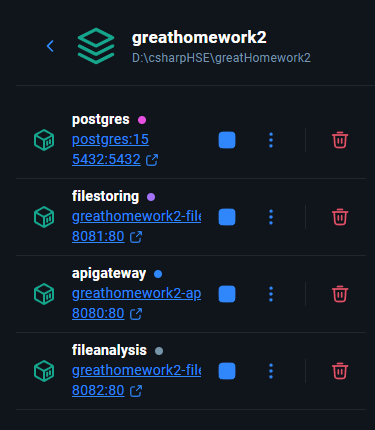
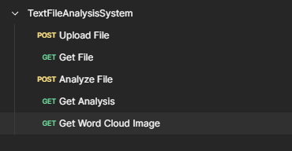
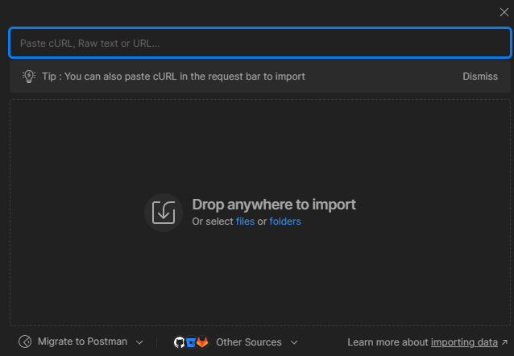
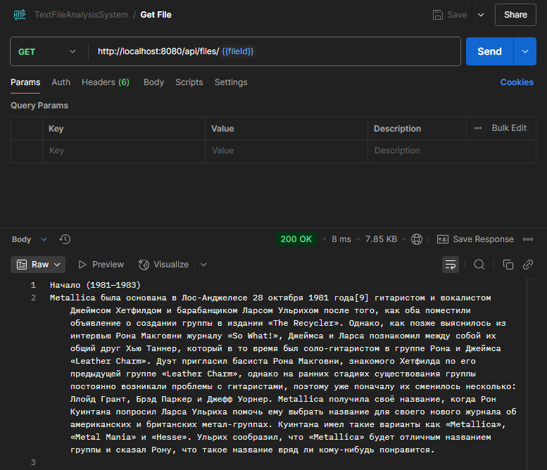
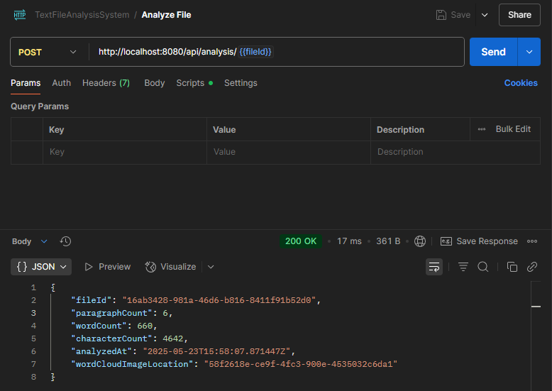
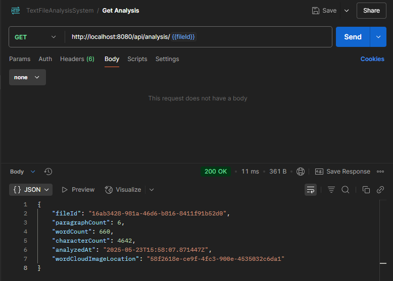
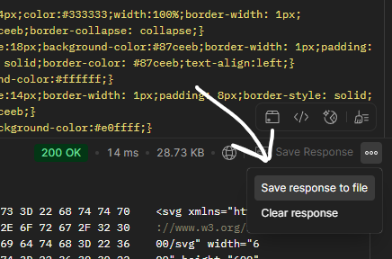
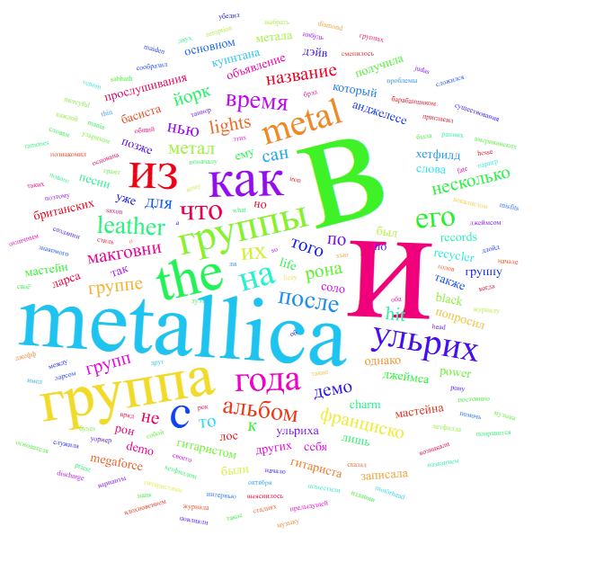

# Контрольная работа № 2 Синхронное межсервисное взаимодействие.

### 1. Описание структуры приложения

Приложение состоит из 3 микросервисов:
- API Gateway - единая точка входа. Отвечает за проксирование и маршрутизацию.
- File Storing Service - отвечает за загрузку, хэширование, хранение и отдачу файлов.
- File Analysis Service - анализирует содержимое файлов и генерирует облака слов.

В качестве базы данных используется PostgreSQL.
Реализована обработка ошибок.

### 2. Архитектура системы

Для создания приложения использовались:
- Микросервисная архитектура
- Docker
- PostgreSQL
- Reverse Proxy (YARP в API Gateway)

### 3. Спецификация API

- **Upload File** (*POST /api/files/upload*) - загрузка .txt файла
- **Get File** (*GET /api/files/{fileId*} - получение содержимого файла
- **Analyze File** (*POST /api/analysis/{fileId}*) - проводит анализ текста и ходит в стороннее API за облаком слов
- **Get Analysis** (*GET /api/analysis/{fileId}*) - возвращает кол-во абзацев, слов, символов
- **Get WordCloud Image** (*GET /api/analysis/image/{imageId}*) - возвращает .svg файл с облаком слов

### 4. Инструкции по запуску и тестированию

#### Запуск

1) Установить и запустить Docker Desktop
2) Построить и собрать контейнеры
> docker compose build

4) Запустить проект 
> docker compose up -d

#### Тестирование

1) Создана коллеция Postman (см. файл .postman_collection.json в папке postman)
2) Каждый запрос отдельно протестирован
3) Результаты корректно возвращаются

Для тестирования проекта необходимо открыть Postman и импортировать туда postman-коллекцию. Как это сделать показано на скриншотах:

#### Результаты отправки запросов:

#### Как открыть изображение с облаком слов:

